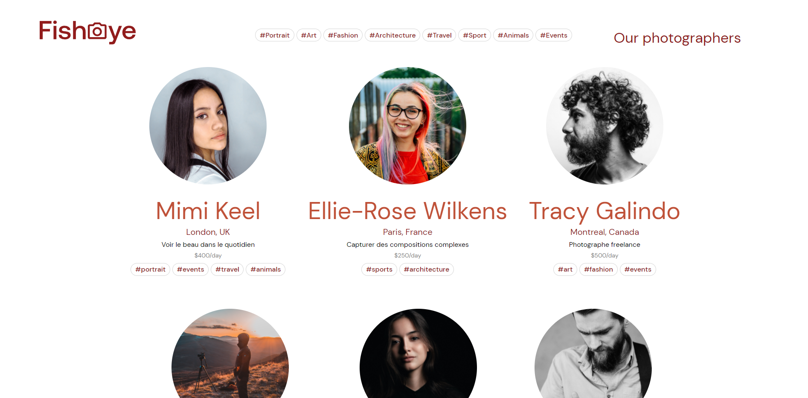
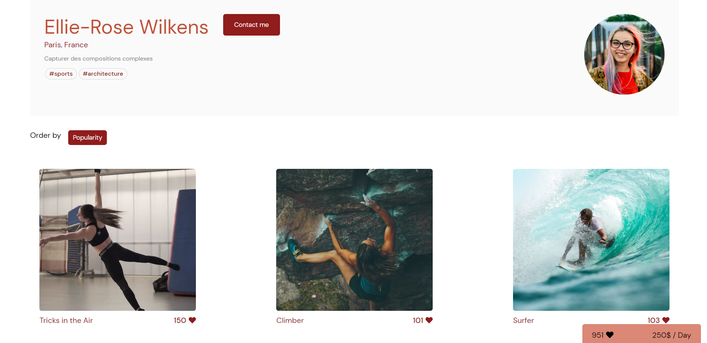

<h1 align="center"></h1>

<h3 align="center">A freelance sourcing platform</h3>

# **[https://fisheye-dylannicolet.netlify.app/](https://fisheye-dylannicolet.netlify.app/)**

>## **In a few words**
Amazing photographers from around the globe will be able to post their creations on this website and the website also offers means for customers to get into contact easily with all photographers.

This website was created for photographers that cannot code but still wish to have their work published on the internet

>## **Developement technologies used**
* HTML
* CSS with SASS
* Vanilla JavaScript only, no framework or libraries 

>## **Key requirements for the project**
1. Accessibility, the website should be fully navigable by keyboard, fully usable with a screen reader and pass the Achecker tests.

2. Website should be dynamically loaded using only information from the provided JSON file which mimicks a database.

3. All filter buttons should be functional and filter the media accordingly

4. Contact form should be functional and paste input to the console

5. Each media should open a lighbox when clicked

6. Website should be mobile friendly and adapt well to desktop

>## **Learning goals of this project**
* Write maintainable JavaScript code
* Develop a modular app with design patterns
* Ensure the full accessibility of a website

>## **Challenges faced**
* Creating the JavaScript code for loading media dynamically for each photographers and have all required functions work properly without bugs.

>## **Goals achieved?**

Absolutely 100%

